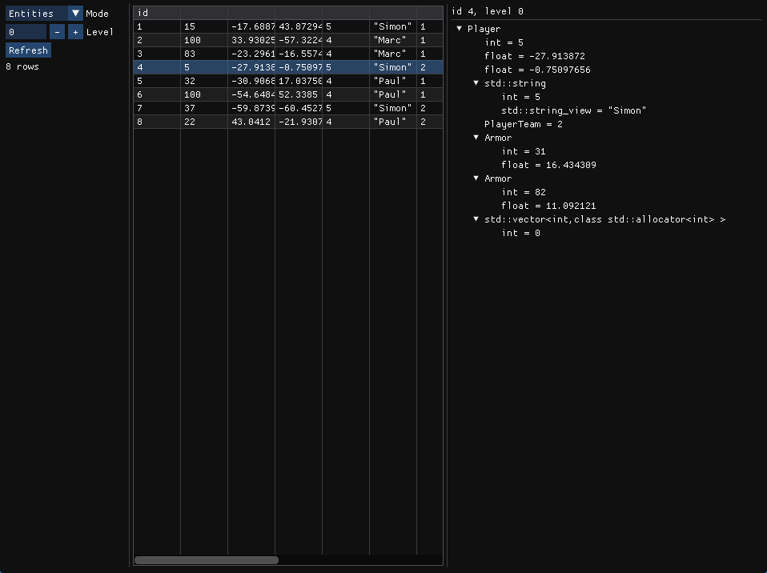
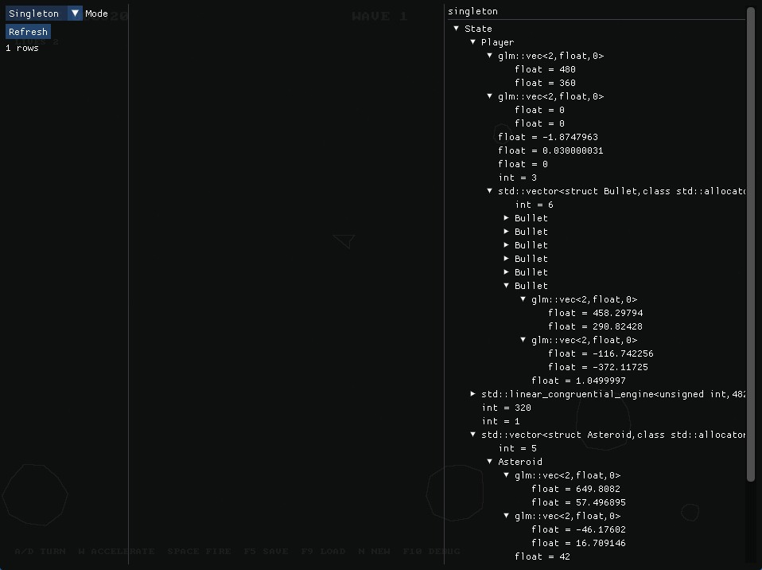

# Savepoint

Savepoint is a lightweight ORM-style serializer for C++ applications.
Inspired by [cereal](https://github.com/USCiLab/cereal) and built on databases like [SQLite](https://sqlite.org/), it provides a simple interface for saving and loading C++ objects.

### Features

- Automatic transactions and schema upgrades
- Entity IDs and 2D/3D spatial keys
- Inherited, nested, polymorphic members and types
- Smart pointers, containers, tuples, random generators, etc
- Opt-in thread safety and concurrent SQLite connections
- Integrated visual debugger

### Limitations

- Saves aren't guaranteed to be portable across platforms

### Examples

You can find all examples [here](examples)

```c++
#include <savepoint/savepoint.hpp>

#include <cassert>

struct Entity : SavepointEntity
{
    int X;
    int Y;

    Entity() = default;
    Entity(int x, int y)
        : X{x}
        , Y{y}
    {
    }

    void Visit(SavepointVisitor& visitor)
    {
        visitor(X);
        visitor(Y);
    }

    bool operator==(const Entity& other) const
    {
        return X == other.X && Y == other.Y;
    }
};

int main()
{
    Savepoint savepoint;
    savepoint.Open(SavepointDriver::SQLite3, "savepoint.sqlite3", SavepointVersion{});

    Entity inEntity{1, 2};
    savepoint.Write(inEntity, 0);
    savepoint.Read<Entity>([&](Entity& outEntity)
    {
        assert(outEntity == inEntity);
    }, 0);
    
    savepoint.Close();
    return 0;
}
```

### CMake

You can clone and add the following to your `CMakeLists.txt`:

```cmake
add_subdirectory(<path>)
target_link_libraries(<name> PRIVATE savepoint::savepoint)
```

### Documentation

The source contains Doxygen-style comments.
You can generate HTML docs with:

```shell
doxygen Doxyfile
```

### Debugger

To use the debugger, enable `SAVEPOINT_DEBUGGER` in CMake and integrate [imgui.hpp](include/savepoint/imgui.hpp) into your application



> Integrated in the [Asteroids](examples/13_asteroids.cpp) example
